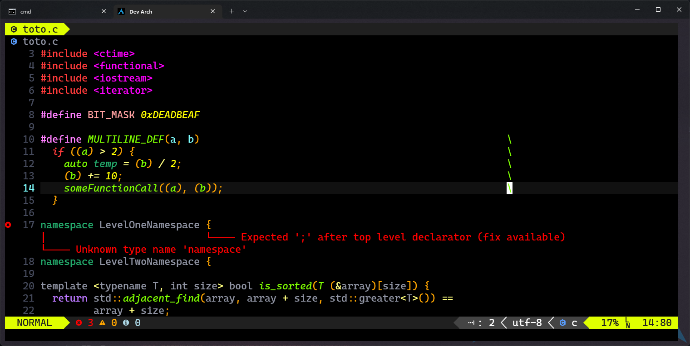
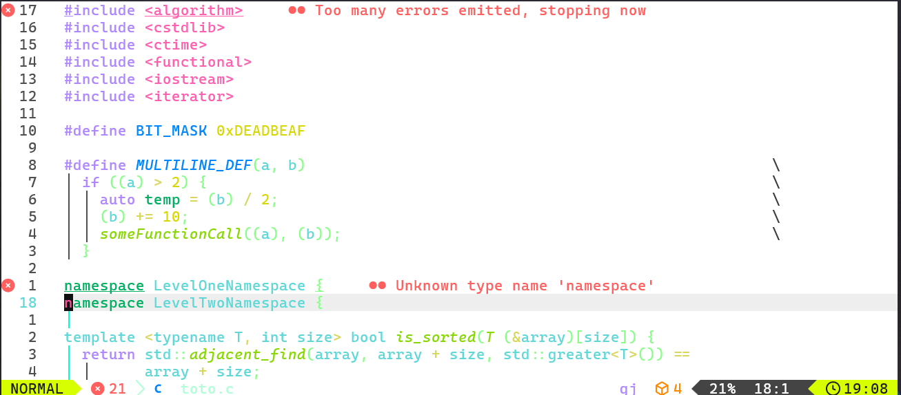
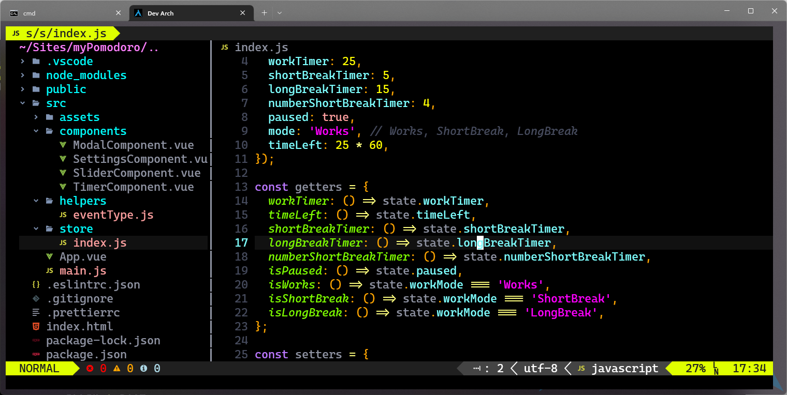
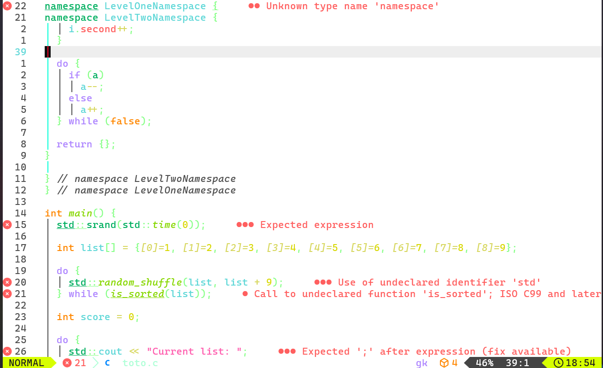

# just-black.nvim

> A minimal, dark Neovim theme in pure Lua — clean, focused, and just black.

created based on [VSCode just-black theme](https://marketplace.visualstudio.com/items?itemName=nur.just-black)

- The dark theme:


- The light theme:


---

## ✨ Features

- Ultra-minimal dark theme for distraction-free coding.
- Written entirely in Lua for fast loading and easy extensibility.
- Fully supports LSP, Tree-sitter, and common Neovim plugins.

---

## ⚙️ Requirements

- Neovim >= 0.8

---

## 📦 Installation

Using [lazy.nvim](https://github.com/folke/lazy.nvim):

```lua
{
  "Atlas34/just-black.nvim",
  lazy = false, -- make sure we load this during startup if it is your main colorscheme
  priority = 1000, -- make sure to load this before all the other start plugins
  config = function()
    require("just-black").setup({
      Transparent = false, -- or true
      Variant = "dark", -- or "light"
    })

    vim.cmd("colorscheme just-black")
  end,
}
```

Using packer.nvim:

```lua
use({
  "Atlas34/just-black.nvim",
  config = function()
    require("just-black").setup({
      Transparent = false, -- or true
      Variant = "dark", -- or "light"
    })

    vim.cmd([[colorscheme just-black]])
  end,
})
```

---

## 🔧 Configuration

`just-black.nvim` provides a simple `setup()` function for configuration. You can set options like background transparency and style variants.

### Example

```lua
require("just-black").setup({
  Transparent = true,     -- Enable transparent background
  Variant = "dark",       -- Available: "dark", "light"
})
```

### Available Options

| Option            | Type      | Default     | Description |
|-------------------|-----------|-------------|-------------|
| `Transparent`     | `boolean` | `false`     | Enables transparent background |
| `Variant`         | `string`  | `"dark"`    | Select a variant of the theme. |
|                 |         |           |    Options: `"dark"`, `"light"`|

---

## 🖌 Usage

Set the colorscheme in Lua or Vimscript:

```lua
vim.cmd([[colorscheme just-black]])
```

or

```vim
colorscheme just-black
```

---

## 🎨 Demo





---

## 📜 License

MIT © Atlas34
