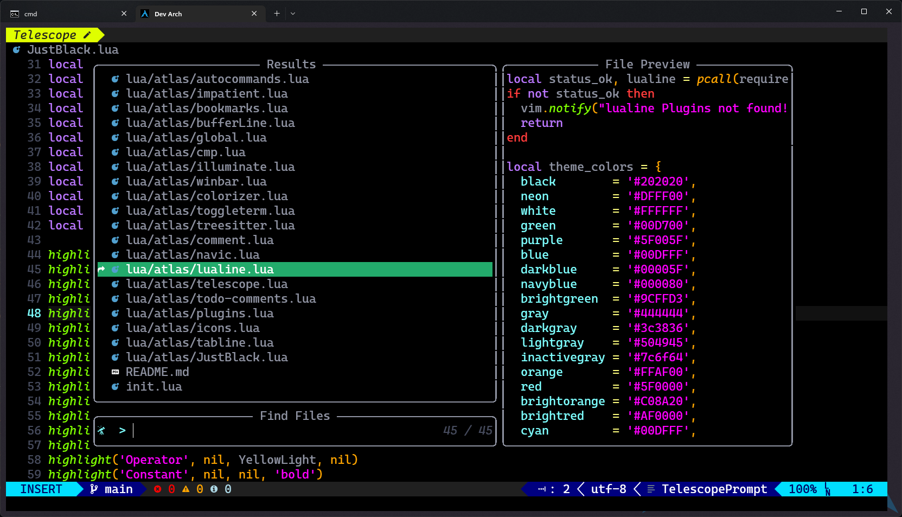

# Just-Black.nvim

created based on [VSCode just-black theme](https://marketplace.visualstudio.com/items?itemName=nur.just-black)

## Installation

```lua
use {
    "Atlas34/just-black.nvim",
    config = function()
        vim.cmd('colorscheme just-black')
    end
}
```

## Demo

 
 
 

